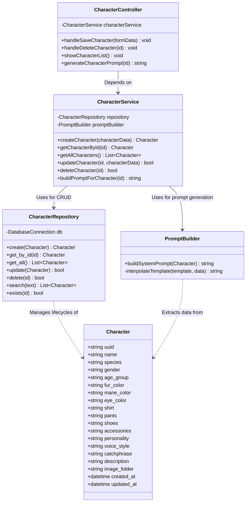

# Character Intelligence

The Character Intelligence System provides reusable character records for future story, image, voice, thumbnail, and animation workflows.

Sprint 3.1 implements the backend foundation only:

- `Character` dataclass model
- `Characters` SQLite table
- `CharacterRepository` CRUD/search/existence methods
- Unit tests for persistence behavior

No UI, dashboard navigation, prompt builder, controller, or service layer is implemented in this sprint.

## Data Model

The `Character` model contains:

- uuid
- name
- species
- gender
- age_group
- fur_color
- mane_color
- eye_color
- shirt
- pants
- shoes
- accessories
- personality
- voice_style
- catchphrase
- description
- image_folder
- created_at
- updated_at

## Repository

`CharacterRepository` owns SQLite persistence for character records.

Methods:

- `create()`
- `update()`
- `delete()`
- `get_by_id()`
- `get_all()`
- `search()`
- `exists()`

All repository methods use parameterized SQL queries, log failures, and re-raise SQLite exceptions for the caller to handle.

## Planned Architecture

