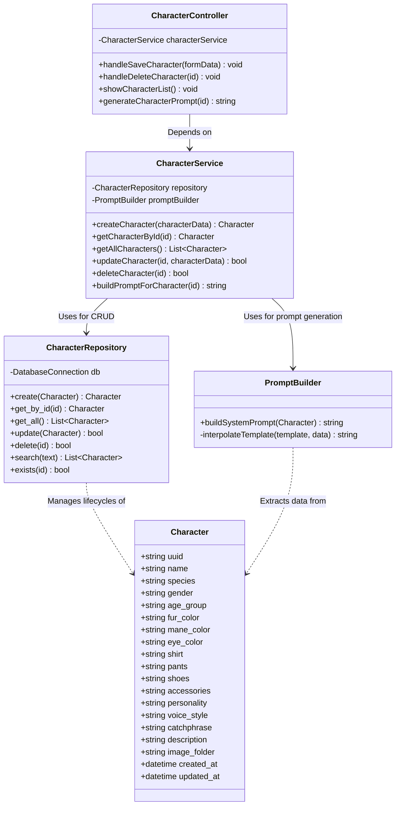

# Character Intelligence

The Character Intelligence System provides reusable character records for future story, image, voice, thumbnail, and animation workflows.

Sprint 3.1 implemented the backend persistence foundation:

- `Character` dataclass model
- `Characters` SQLite table
- `CharacterRepository` CRUD/search/existence methods
- Unit tests for persistence behavior

Sprint 3.2 adds the backend business logic layer:

- `CharacterService`
- Required-field validation
- Duplicate name validation
- Description length validation
- UUID immutability checks
- Image folder validation
- Structured JSON export
- Reusable prompt generation
- Unit tests for service behavior

No UI, dashboard navigation, or controller is implemented in Sprint 3.2.

## Data Model

The `Character` model contains:

- uuid
- name
- species
- gender
- age_group
- fur_color
- mane_color
- eye_color
- shirt
- pants
- shoes
- accessories
- personality
- voice_style
- catchphrase
- description
- image_folder
- created_at
- updated_at

## Repository

`CharacterRepository` owns SQLite persistence for character records.

Methods:

- `create()`
- `update()`
- `delete()`
- `get_by_id()`
- `get_all()`
- `search()`
- `exists()`

All repository methods use parameterized SQL queries, log failures, and re-raise SQLite exceptions for the caller to handle.

## Service

`CharacterService` owns business rules for character workflows.

Methods:

- `create_character()`
- `update_character()`
- `delete_character()`
- `get_character()`
- `get_all_characters()`
- `search_characters()`
- `character_exists()`
- `export_json()`
- `build_prompt()`

The service raises meaningful exceptions instead of printing errors:

- `CharacterValidationError`
- `CharacterNotFoundError`

The service logs character creation, updates, deletion, validation failures, and JSON export.

## JSON Export

`export_json()` returns a JSON-ready object and does not write files.

Top-level sections:

- identity
- appearance
- personality
- voice
- images

## Prompt Builder

`build_prompt()` returns a reusable character description for future Story, Image, Thumbnail, Voice, and Animation agents.

## Planned Architecture

```mermaid
classDiagram
    class CharacterController {
        -CharacterService characterService
        +handleSaveCharacter(formData) void
        +handleDeleteCharacter(id) void
        +showCharacterList() void
        +generateCharacterPrompt(id) string
    }

    class CharacterService {
        -CharacterRepository repository
        -PromptBuilder promptBuilder
        +createCharacter(characterData) Character
        +getCharacterById(id) Character
        +getAllCharacters() List~Character~
        +updateCharacter(id, characterData) bool
        +deleteCharacter(id) bool
        +buildPromptForCharacter(id) string
    }

    class CharacterRepository {
        -DatabaseConnection db
        +create(Character) Character
        +get_by_id(id) Character
        +get_all() List~Character~
        +update(Character) bool
        +delete(id) bool
        +search(text) List~Character~
        +exists(id) bool
    }

    class PromptBuilder {
        +buildSystemPrompt(Character) string
        -interpolateTemplate(template, data) string
    }

    class Character {
        +string uuid
        +string name
        +string species
        +string gender
        +string age_group
        +string fur_color
        +string mane_color
        +string eye_color
        +string shirt
        +string pants
        +string shoes
        +string accessories
        +string personality
        +string voice_style
        +string catchphrase
        +string description
        +string image_folder
        +datetime created_at
        +datetime updated_at
    }

    CharacterController --> CharacterService : Depends on
    CharacterService --> CharacterRepository : Uses for CRUD
    CharacterService --> PromptBuilder : Uses for prompt generation
    CharacterRepository ..> Character : Manages lifecycles of
    PromptBuilder ..> Character : Extracts data from
```
